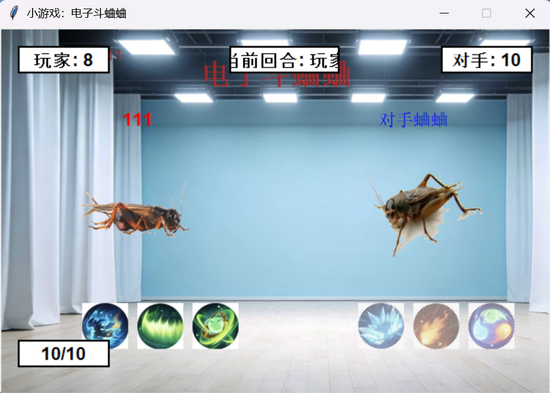

# Electronic-Cricket-Battle-Mini-Game (电子斗蛐蛐小游戏)
This is a turn-based cricket battle game. Players and AI take turns to fight, spending charge to cast skills with GIF animations and sound effects. The AI makes rule-based skill choices. It has a start menu, input system and complete battle process. Fully offline with simple controls, ideal for casual play.
这是一款回合制对战小游戏，主打电子斗蛐蛐玩法。玩家与 AI 轮流行动，消耗蓄力值释放技能互相攻击，技能触发自带 GIF 动画与音效。AI 按固定规则自动出招，游戏含主菜单、操作输入与完整对战流程，单机免联网，操作简单，适合休闲打发时间。

## How to use 如何使用
You only need to run source code.py .
你只需要运行source code.py

## How to package into an .exe file (如何打包成.exe文件)
Run the following command in the CMD window : **pyinstaller --onefile --noconsole game.py**
在cmd窗口运行: **pyinstaller --onefile --noconsole game.py**

